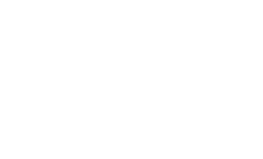

# 👋 Hi, I'm Klesti!

My Portoflio: https://selimaj.dev

  

  

👨🏻‍💻 A 16 year old Software Engineer with 6 years of experience trying to master everything.

💡 Passionate about low-level systems, hacking, UI/UX, and making cool tools.

🔧 Favorite tech: Rust, Linux, TUI apps, and everything in between.

---

## 📱 My Socials

<table>
  <tr>
    <td>
      
    </td>
    <td>
      
    </td>
    <td>
      
    </td>
    <td>
      
    </td>
  </tr>
</table>

## 💻 My Skills

<table>
  <tr>
    <td></td>
    <td></td>
    <td></td>
    <td></td>
    <td></td>
    <td></td>
    <td></td>
    <td></td>
  </tr>
</table>

###

